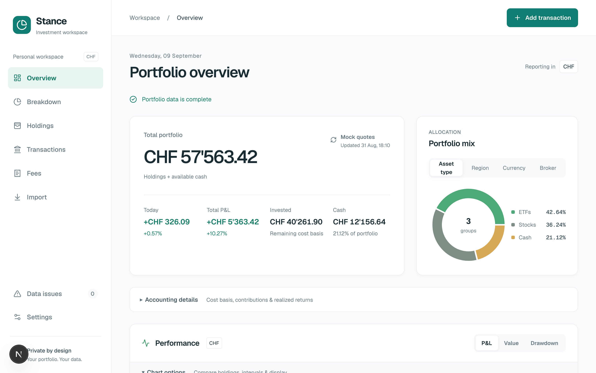
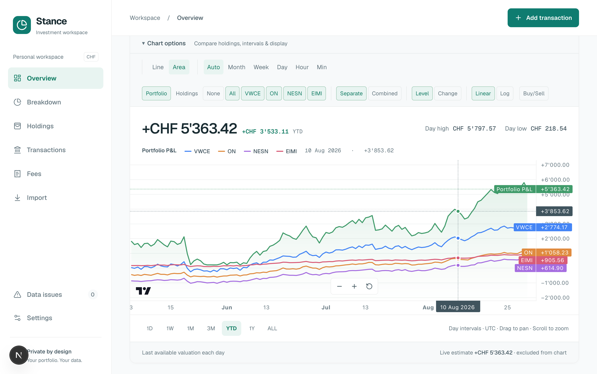
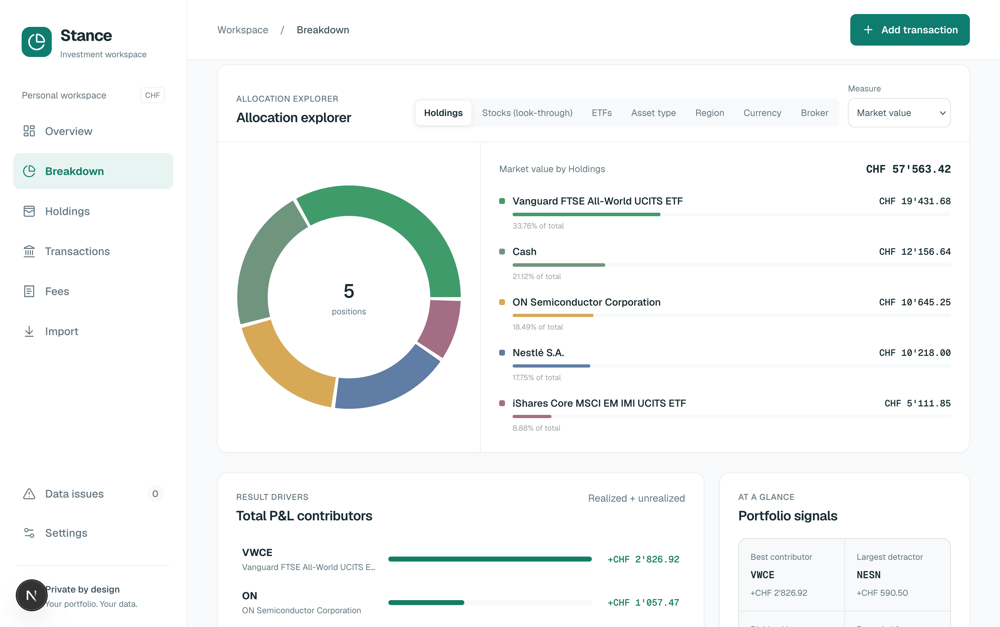

# Stance

Local portfolio tracker for investors who want to understand their holdings accross brokers and currencies.

Stance turns broker transactions into a clear central portfolio, with CHF reporting, historical performance, allocation views, and data-quality checks. It runs on your machine: your database, broker credentials, and imported statements stay there.

> Stance is an early-stage personal project, under active development. It is not investment, tax, or financial advice.

## A Quick Look

All screenshots below use the included fictional sample portfolio.







## Why I Made This

I wanted a portfolio tracker that is useful without asking me to upload my complete financial history to a third party. Existing tools often hide the underlying ledger, make broker imports opaque, or treat a portfolio primarily as a trading surface.

Stance is built around a simpler idea: keep the data local, make the accounting inspectable, and let the portfolio history follow from the transactions.

## What It Does

- Tracks buys, sells, dividends, deposits, withdrawals, interest, and fees
- Calculates cash, cost basis, realized and unrealized P&L, and contribution-aware absolute P&L
- Reports everything in CHF while retaining each transaction's original currency
- Imports DEGIRO transaction and account-statement CSVs
- Syncs Trading 212 fills, dividends, cash movements, positions, and current prices through its read-only API
- Shows holdings, broker splits, allocation, performance charts, fees, and portfolio data issues
- Builds regional exposure from ETF look-through data, issuer sources, conservative classification, and manual overrides
- Uses duplicate-safe imports, so overlapping statement exports or repeated syncs are safe

## Privacy and Safety

- Your SQLite database lives locally and is ignored by Git.
- Imported CSVs are previewed and parsed without being retained on disk.
- Trading 212 keys stay server-side in your local environment; the integration has no trade-placement capability.
- The included sample portfolio is entirely fictional.
- No telemetry, account, or hosted backend is required for local development.

Stance is intended for one trusted local user. It has no authentication or multi-user tenancy, so do not expose a running instance to the public internet.

## Quick Start

### Requirements

- Node.js 20+
- npm

### Run locally

```bash
git clone https://github.com/ericceg/stance.git
cd stance
npm install
cp .env.example .env
npm run db:setup
npm run dev
```

Open [http://localhost:3000](http://localhost:3000). The setup command creates a local SQLite database, applies the committed migrations, and loads a fictional sample portfolio.

### Run as a desktop app

Install Node.js 22+ and the [Tauri prerequisites](https://v2.tauri.app/start/prerequisites/) for your operating system, then run:

```bash
npm run desktop:dev
```

This opens the same Next.js application in a native window, backed by the same source code. Development mode uses the normal local database and `.env` configuration. To create a native installer:

```bash
npm run desktop:build
```

Packaged desktop releases keep their SQLite database in the operating system's per-user application-data directory. Committed Prisma migrations are applied automatically when the desktop app starts. The browser and desktop targets therefore share all UI, accounting, import, and persistence code; only the desktop launcher and packaging live under `src-tauri/` and `desktop/`.

Useful commands:

```bash
npm test          # unit tests
npm run lint      # ESLint
npm run build     # production build
npm run check     # lint, tests, and production build
npm run db:studio # browse the local database
```

## Importing Your Portfolio

### DEGIRO

Export a **Transaction statement** and/or **Account statement** CSV from DEGIRO's Inbox. In Stance, open **Import**, select the appropriate account and file, review the preview, and import it. Trade-settlement cash rows are ignored to avoid double counting, and stable row fingerprints keep repeated or overlapping imports safe.

Stance looks up current quotes for open DEGIRO positions by ISIN through Yahoo Finance. It uses Frankfurter for current and historical CHF conversion.

### Trading 212

Create a read-only Trading 212 API key with access to account data, portfolio, and history. Do not grant order permissions. Add the credentials to your local `.env`:

```bash
TRADING212_API_KEY=
TRADING212_API_SECRET=
TRADING212_ENVIRONMENT=live # or demo
```

Restart the development server, then select **Sync now** on the Import page. Syncing imports completed fills, dividends, cash movements, interest, fees, open positions, and current prices. Internal transfers and unsupported corporate actions are skipped deliberately.

## How It Works

Positions are derived from the transaction ledger in time order; they are never stored as an independent source of truth. Stance uses weighted-average cost basis: purchase fees increase cost basis, while sale fees reduce realized P&L. Invalid rows, including oversells, are excluded from calculations and shown as data issues instead of being silently corrected.

The app uses Next.js, TypeScript, Prisma, and SQLite. Portfolio accounting and import logic are kept separate from the UI and external provider adapters, so the local persistence layer and data providers can evolve independently.

```text
SQLite / Prisma
      │
      ▼
portfolio ledger ── broker + market-data providers
      │
      ▼
accounting and history reconstruction
      │
      ▼
Next.js interface
```

## Development Notes

- Copy `.env.example` to `.env`; never commit real credentials or use `NEXT_PUBLIC_` for them.
- `npm run db:seed` resets the local database to the fictional sample dataset.
- SQLite is designed for local use. A hosted deployment needs durable, authenticated infrastructure (for example PostgreSQL); serverless local files are not persistent.
- External market-data and issuer endpoints can be temporarily unavailable. When an FX rate needed for an import is missing, the import is not saved and can be retried.

## Roadmap

- Security and ticker editing/merging
- Transaction editing
- Historical security charts
- Time- and money-weighted returns
- A clear path from single-user local use to a safely hosted deployment

## Contributing

Issues and pull requests are welcome, especially for broker import edge cases, accounting tests, and documentation. Please include a focused description, keep fixture data fictional, and run `npm run check` before opening a pull request.

## License

MIT. See [LICENSE](LICENSE).
